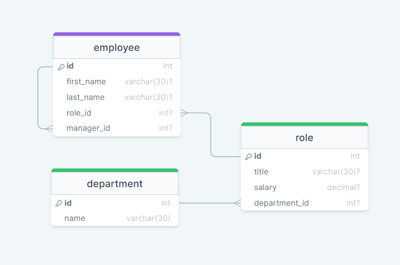

[](https://git.io/typing-svg)  

---
# Introduction

## Employee Tracker [](#license)

This simple CMS application designed for a user to be able to view and interact with an employee tracking database. See a brief demo of the app here

## Table of Contents

- [Introduction](#introduction)
- [Demo](#demo)
- [Installation](#installation)
- [Usage](#usage)
- [Dependencies](#dependencies)
- [Database Schema](#databaseschema)
- [Contribution](#contribution)
- [Questions](#questions)
- [License](#license)

## Demo
- [employee-tracker.mkv](https://github.com/jakefred6/employee-tracker/demo/employee-tracker.mkv)


## Installation

To run the application locally, follow these steps:

```bash
# Clone the repository
$ git clone https://github.com/Jakefred6/employee-tracker.git

# Navigate to the project directory
$ cd employee-tracker

# Install dependencies
$ npm install

# Start the application:
$ npm start
```

## Dependencies

- [MYSQL2](https://www.npmjs.com/package/mysql2)  [](https://www.npmjs.com/package/mysql2)
- [INQUIRER](https://www.npmjs.com/package/inquirer) [](https://www.npmjs.com/package/inquirer)


## Database Setup
```
mysql -u root -p
Password: <your password>
show databases;
source schema.sql;
source seeds.sql;
show full tables;
select * from department;
select * from entitlement;
select * from employee;
```

## Usage
```
 $ npm start
```

## Database Schema

Database schema consists of three tables:



### 1. Departments Table

The `department` table stores information about different departments within the organization.

- **Columns:**
  - `id` (INT): Unique identifier for the department.
  - `name` (VARCHAR(30)): Name of the department, cannot be null.

### 2. Roles Table

The `role` table holds data related to various job roles in the organization.

- **Columns:**
  - `id` (INT): Unique identifier for the role.
  - `title` (VARCHAR(30)): Title of the role.
  - `salary` (DECIMAL): Salary associated with the role.
  - `department_id` (INT): Foreign key referencing the 'departments' table.
    - Set to null on delete to handle cascading deletes.

### 3. Employees Table

The `employee` table contains information about the employees in the organization.

- **Columns:**
  - `id` (INT): Unique identifier for the employee.
  - `first_name` (VARCHAR(30)): First name of the employee.
  - `last_name` (VARCHAR(30)): Last name of the employee.
  - `role_id` (INT): Foreign key referencing the 'roles' table.
    - Set to null on delete to handle cascading deletes.
  - `manager_id` (INT): Foreign key referencing the same 'employees' table for manager relationship.
    - Set to null on delete to handle cascading deletes.

## Contribution
Contributions are welcome! If you find any issues or have suggestions for improvement, please create an issue or submit a pull request.


## Questions
or any questions related to the repo, you can reach out to me at [Jakefred6@yahoo.com](mailto:Jakefred6@yahoo.com)

You can also find me on GitHub: [Jakefred6](https://github.com/Jakefred6/)

## License [](#license)
This Employee Tracker is licensed under the MIT License.

---
Feel free to customize the content further based on your preferences and the specifics of your project.